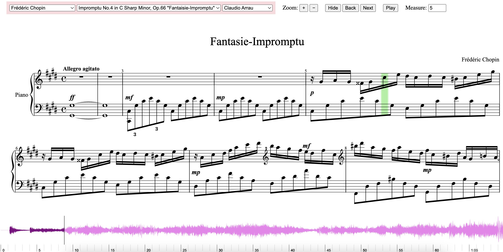

# SIMP: Synchronized Interactive Music Player 
### An interactive tool for exploring score-aligned performances

## About SIMP

SIMP is a web-based prototype tool that allows users to interactively explore and navigate classical piano recordings alongside their corresponding scores.

The project website is at [https://facultystaff.richmond.edu/~yjiang3/papers/am23/](https://facultystaff.richmond.edu/~yjiang3/papers/am23/).

## Dataset
Our musical repertoire currently contains 54 performances played by 20 world-renowned pianists. The table below shows the specific breakdown of the contents within our database.

|Composer|# of Scores|# of Performers|
|--------|-----------|---------------|
|Claude Debussy|5|15|
|Franz Liszt|2|4|
|Franz Schubert|3|6|
|Frédéric Chopin|5|14|
|Johann Sebastian Bach|6|7|
|Ludwig van Beethoven|3|5|
|Wolfgang Amadeus Mozart|1|3|

The digital scores and the performances used were retrieved from the [ATTEP](https://github.com/BetsyTang/ATEPP) dataset.

## Credits
The Synchronized Interactive Music Player was devised and developed by Caitlin Sales, Peiyi Wang and Professor Yucong Jiang - [University of Richmond](https://www.richmond.edu/)

Note that SIMP makes use of the following libraries:
* OpenSheetMusicDisplay - [GitHub repo](https://github.com/opensheetmusicdisplay/opensheetmusicdisplay), [Webpage](https://opensheetmusicdisplay.org/)
* wavesurfer.js - [GitHub repo](https://github.com/katspaugh/wavesurfer.js), [Webpage](https://wavesurfer-js.org/)

## Citation

```
@inproceedings{simp,
  title={An Interactive Tool
  for Exploring Score-Aligned Performances: Opportunities for Enhanced
  Music Engagement},
  author={Sales, Caitlin and Wang, Peiyi and Jiang, Yucong},
  booktitle={Audio Mostly 2023 (AM ’23)},
  year={2023}
}
```
